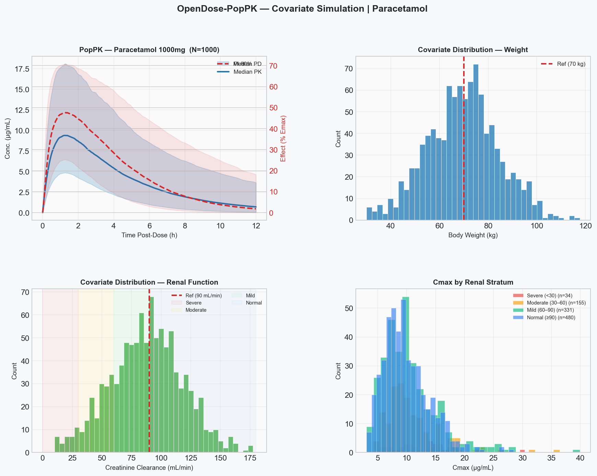
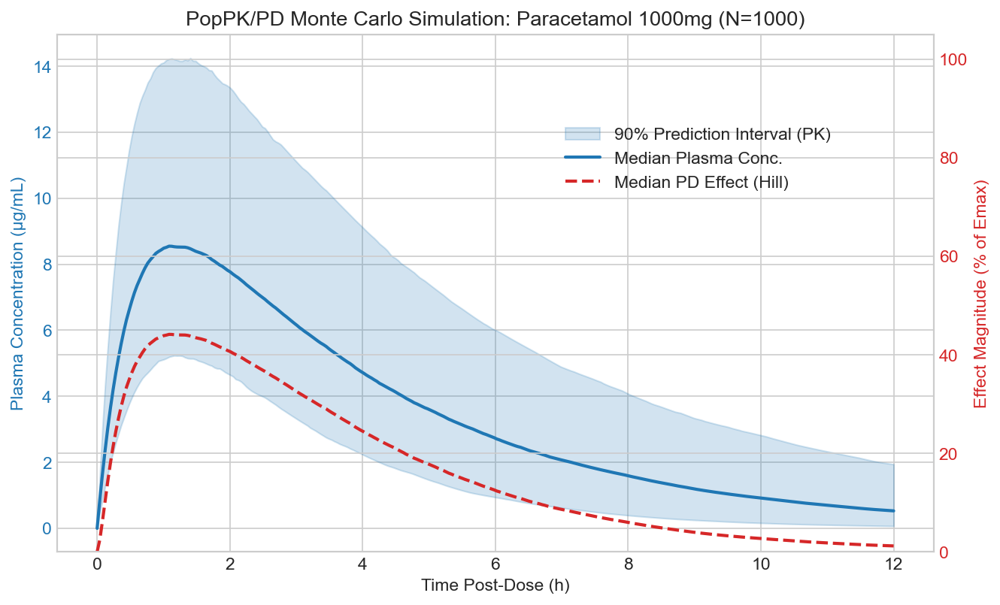
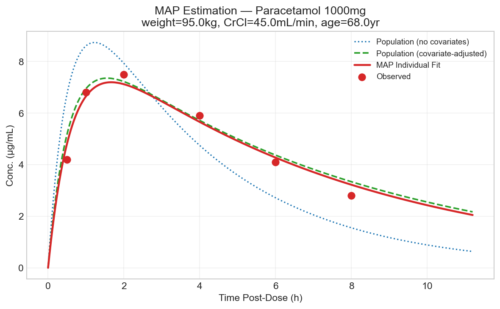
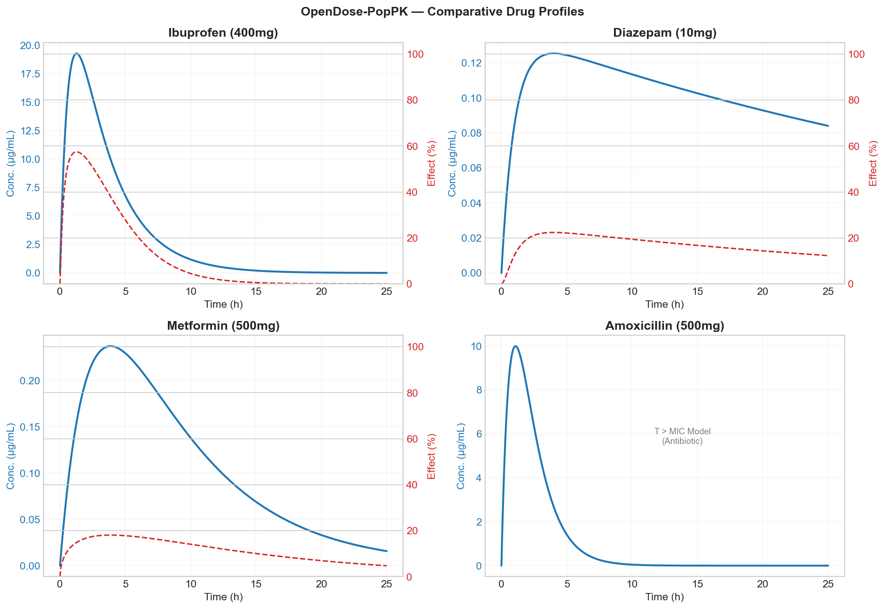

[](https://opensource.org/licenses/MIT)
[](https://www.python.org/downloads/)
[](https://github.com/psf/black)
[](https://github.com/redkk123/OpenDose-PopPK/actions/workflows/ci.yml)
[](https://github.com/redkk123/OpenDose-PopPK/actions/workflows/docs.yml)
[](https://github.com/redkk123/OpenDose-PopPK/actions/workflows/release.yml)


# OpenDose-PopPK 🔬💊

**A modular, open-source Python framework for Population Pharmacokinetic-Pharmacodynamic (PopPK/PD) modeling.**

The library bridges classical compartmental pharmacology and modern control theory by integrating state-space representation, stochastic Monte Carlo simulations, and Bayesian individual parameter estimation.

---

## ✨ Features

- **1-compartment PK model** — first-order analytical solution with state-space formalism
- **Multiple-dose regimen support** — repeated dosing at fixed intervals
- **Emax Hill PD model** — sigmoidal pharmacodynamic effects
- **Monte Carlo simulation** — inter-individual variability with 90% prediction intervals
- **Covariate modeling** — weight, renal function (CrCl), age, hepatic markers (Power Model)
- **MAP estimation** — individual Bayesian fitting from sparse observed samples
- **Clinical TDM input validation** — CSV cleaning and summary for patient observations
- **Drug dataset validation** — schema and value checks for drug parameter CSV
- **Batch TDM fitting** — MAP estimation per patient from real-world monitoring tables
- **TDM prediction diagnostics** — per-observation predictions and residual error tables
- **Observed-vs-predicted diagnostic plot** — quick visual goodness-of-fit check
- **Population PK fitting (naive pooled)** — estimate typical PK parameters from TDM datasets
- **Bootstrap uncertainty for population fit** — confidence intervals for F/ka/ke/Vd
- **End-to-end TDM workflow command** — run full clinical pipeline in one execution
- **Multi-drug regimen benchmarking** — compare Cmax/trough/AUC across selected compounds
- **Mixed-drug TDM fitting** — run MAP fits when a single CSV contains multiple drugs
- **Dose recommendation engine** — suggest dose for target Cmax/AUC (with covariate adjustment)
- **Regimen dose recommendation** — suggest repeated-dose amount for target Cmax/trough
- **Therapeutic-window regimen recommendation** — suggest repeated-dose amount for trough/Cmax window
- **Local sensitivity analysis** — quantify how PK parameters impact Cmax/AUC
- **Project health report** — generate JSON/Markdown diagnostics (dataset + smoke + sensitivity)
- **DrugDatabase** — loads and manages parameters from CSV
- **Publication-ready figures** — all plots from the companion paper

---

## 📊 Results

### Population Simulation with Covariates


### Monte Carlo — Paracetamol 1000mg (N=1000)


### MAP Estimation — Individual Patient


### Multi-Drug Comparison


---

## 🛠️ Installation

```bash
git clone https://github.com/redkk123/OpenDose-PopPK.git
cd OpenDose-PopPK
# Recommended: install the package for local development
pip install -e .
# or install the package (non-editable) and dev dependencies
pip install .
pip install -r requirements.txt
```

### Running tests

```bash
python -m pytest -q
```

On Windows: `make.bat test` or `python -m pytest -q`

With coverage: `pip install .[dev]` then `pytest --cov=opendose_poppk --cov-report=term-missing`

Latest local validation: March 5, 2026 (Python 3.14.2), `python -m pytest -q` -> `135 passed`.

### CLI

```bash
opendose list-drugs
opendose validate-dataset --output-clean output/tables/drugs_parameters_clean.csv
opendose simulate --drug Paracetamol --n-subjects 200 --t-max 12 --output output/tables/paracetamol_cli.csv
opendose sensitivity --drug Paracetamol --dose 1000 --rel-step 0.1 --output-csv output/tables/sensitivity_paracetamol.csv
opendose simulate-regimen --drug Paracetamol --interval-h 12 --n-doses 4 --output-csv output/tables/paracetamol_regimen.csv --plot-png output/figures/paracetamol_regimen.png
opendose fit --drug Paracetamol --times 0.5,1,2,4 --obs 4.2,6.8,7.5,5.9 --weight 80 --crcl 70 --age 55
opendose validate-tdm --input data/tdm.csv --output-clean output/tables/tdm_clean.csv
opendose fit-tdm --drug Paracetamol --input data/tdm.csv --output output/tables/tdm_fit.csv --predictions-csv output/tables/tdm_predictions.csv --plot-png output/figures/tdm_obs_vs_pred.png --report-md output/reports/tdm_fit_report.md
opendose fit-population --input data/tdm.csv --maxiter 2000 --bootstrap-n 200 --output-json output/reports/pop_fit.json
opendose init-tdm-template --output data/tdm_template.csv
opendose run-tdm-workflow --drug Paracetamol --input data/tdm.csv --outdir output/workflows/tdm_paracetamol
opendose benchmark-regimen --drugs Paracetamol,Ibuprofen,Diazepam --interval-h 12 --n-doses 4 --output-csv output/tables/regimen_benchmark.csv
opendose fit-tdm-mixed --input data/tdm_mixed.csv --output output/tables/tdm_mixed_fit.csv
opendose doctor --strict
opendose project-report --drug Paracetamol --output-md output/reports/project_report.md
opendose recommend-dose --drug Paracetamol --target-cmax 10 --weight 80 --crcl 70 --age 55 --output-json output/reports/dose_recommendation.json
opendose recommend-regimen-dose --drug Paracetamol --target-trough 1.0 --interval-h 12 --n-doses 4 --output-json output/reports/regimen_dose_recommendation.json
opendose recommend-regimen-window --drug Paracetamol --target-trough-min 0.05 --target-cmax-max 12.0 --interval-h 12 --n-doses 4 --strategy midpoint --output-json output/reports/regimen_window_recommendation.json
```

### Generating figures

```bash
python main.py
```

Figures are saved to `figures/`. On Windows: `make.bat figures`

---

## 🚀 Quick Start

```python
from opendose_poppk import DrugDatabase, PKModel, PDModel
import numpy as np

# Load parameters from CSV
db   = DrugDatabase("datasets/drugs_parameters.csv")
drug = db.get_drug("Paracetamol")

# Build PK/PD models
pk = PKModel(**drug.pk_kwargs)
pd = PDModel(drug.EC50, drug.n_hill)

# Simulate
t = np.linspace(0, 12, 300)
C = pk.concentration(t, D=drug.dose)
E = pd.effect(C)

# Analytical metrics
cmax, tmax = pk.cmax(D=drug.dose)
auc        = pk.auc(D=drug.dose)
print(f"Cmax = {cmax:.2f} µg/mL at Tmax = {tmax:.2f} h")
print(f"AUC₀→∞ = {auc:.1f} µg·h/mL")
```

---

## Radioactive Isotope Modeling (Physical Decay)

OpenDose-PopPK supports pharmacokinetic modeling of **radioactive pharmaceuticals** (e.g., Lu-177, I-131, Y-90) by incorporating physical decay of the isotope.

### Theory

For radioactive drugs, the activity (MBq) decays due to both biological elimination and physical decay of the isotope:

$$\frac{dA}{dt} = -\left(k_e + \lambda_{\text{phys}}\right)A(t)$$

where:
- $k_e$ — biological elimination rate constant (h⁻¹)
- $\lambda_{\text{phys}}$ — physical decay constant (h⁻¹) =  $\frac{\ln(2)}{t_{1/2}}$
- $t_{1/2}$ — physical half-life of the isotope (hours)

The overall clearance is the **sum of biological and physical elimination**.

### Example: Lu-177 (Lutetium-177)

```python
from opendose_poppk import PKModel
import numpy as np

# Lu-177 half-life: 6.647 days = 159.528 hours
pk = PKModel(
    F=1.0,                      # 100% bioavailability (IV injection)
    ka=0.0,                     # no absorption (IV)
    ke=0.01,                    # biological clearance (h⁻¹)
    Vd=5.0,                     # volume of distribution (L)
    Q=0.5,                      # inter-compartment flow (L/h)
    V2=2.0,                     # peripheral volume (L)
    phys_half_life_h=159.528    # Lu-177 physical half-life in hours
)

# Dose: 7400 MBq (typical therapeutic activity)
t = np.linspace(0, 168, 500)  # 7 days
A = pk.concentration(t, D=7400.0)  # Activity profile (MBq)

# AUC accounts for both biological and physical elimination
auc = pk.auc(D=7400.0)
print(f"AUC₀→∞ = {auc:.1f} MBq·h")
```

### Key Parameters (Unit Consistency)

| Parameter | Unit | Description |
|-----------|------|-------------|
| `D` | MBq (or Bq) | Initial activity dose |
| `t` | h (hours) | Time post-injection |
| `C` or `A1` | MBq or MBq/L | Activity in compartment (central, peripheral) |
| `CL` | L/h | Biological clearance rate |
| `V1`, `V2` | L | Central and peripheral volumes |
| `Q` | L/h | Inter-compartmental flow |
| `phys_half_life_h` | h (hours) | Physical half-life of isotope |
| `lambda_phys` | h⁻¹ | Physical decay constant = ln(2) / t_1/2 |

### Decay Impact on PK Metrics

**Without decay:** AUC = F·D / CL  
**With decay:** AUC is reduced; computed numerically:
$$\text{AUC}_{0→\infty} = \int_0^∞ C(t) \, dt \quad \text{(includes} \, \lambda_{\text{phys}})$$

```python
# Compare models with/without decay
pk_no_decay = PKModel(F=1.0, ka=0.0, ke=0.01, Vd=5.0)
pk_with_decay = PKModel(F=1.0, ka=0.0, ke=0.01, Vd=5.0,
                        phys_half_life_h=159.528)

auc_no_decay = pk_no_decay.auc(D=7400.0)
auc_with_decay = pk_with_decay.auc(D=7400.0)

print(f"AUC without decay: {auc_no_decay:.1f} MBq·h")
print(f"AUC with decay:    {auc_with_decay:.1f} MBq·h")
print(f"Reduction: {100*(auc_no_decay - auc_with_decay)/auc_no_decay:.1f}%")
```

### Balance of Mass (Mass Balance Check)

The model enforces conservation of mass across compartments:

$$\frac{d(A_1 + A_2)}{dt} = -\text{CL} \frac{A_1}{V_1} - \lambda_{\text{phys}}(A_1 + A_2)$$

This ensures:
- Biological clearance acts only on central concentration
- Physical decay acts on activity in **all** compartments
- Total activity decreases exponentially when no input

### Common Radioisotopes

| Isotope | Half-Life | Application |
|---------|-----------|------------|
| **Lu-177** | 6.647 days | Peptide receptor radionuclide therapy (PRRT) |
| **I-131** | 8.0 days | Thyroid cancer, hyperthyroidism |
| **Y-90** | 64.1 hours | Radioembolization, monoclonal antibody therapy |
| **Tc-99m** | 6.0 hours | Diagnostic imaging |
| **F-18** | 110 minutes | PET imaging |

---

## Covariate-Adjusted Simulation

```python
from opendose_poppk import CovariateModel, PopulationSimulator

cov = CovariateModel(pk)
sim = PopulationSimulator(pk, pd, cov, dose=drug.dose)

result = sim.run(
    n_subjects=1000,
    t_max=12.0,
    covariates={
        "weight": ("normal", 70.0, 15.0),   # kg
        "crcl":   ("normal", 90.0, 30.0),   # mL/min — renal function
        "age":    ("normal", 45.0, 15.0),   # years
    }
)
```

---

## 🧑‍⚕️ Individual MAP Estimation

```python
from opendose_poppk import MAPEstimator
import numpy as np

t_obs = np.array([0.5, 1.0, 2.0, 4.0, 6.0, 8.0])
c_obs = np.array([4.2, 6.8, 7.5, 5.9, 4.1, 2.8])

est = MAPEstimator(pk, covariate_model=cov, sigma_obs=0.8)
res = est.fit(
    times=t_obs, obs=c_obs,
    patient_covariates={"weight": 95.0, "crcl": 45.0, "age": 68.0},
    dose=drug.dose
)

print(res["params_map"])
```

---

## 📐 Mathematical Background

### PK Model (Eq. 1)

$$C(t) = \frac{F \cdot D \cdot k_a}{V_d(k_a - k_e)}\left(e^{-k_e t} - e^{-k_a t}\right)$$

### State-Space Representation (Section 3)

$$\dot{\mathbf{x}} = \mathbf{A}\mathbf{x} + \mathbf{B}u, \quad
\mathbf{A} = \begin{bmatrix}-k_a & 0 \\ k_a & -k_e\end{bmatrix}$$

Eigenvalues $\lambda = \{-k_a, -k_e\}$ guarantee asymptotic stability.

### Covariate Power Model

$$\theta_i = \theta_{pop} \cdot \prod_k\left(\frac{COV_k}{ref_k}\right)^{\beta_k} \cdot e^{\eta_i}, \quad \eta_i \sim \mathcal{N}(0, \omega^2)$$

---

## 📁 Project Structure

```
OpenDose-PopPK/
├── opendose_poppk/         ← Core package (PK, PD, covariate, population, bayesian)
├── main.py                 ← Full pipeline (generates all figures)
├── docs/                   ← Sphinx documentation
├── notebooks/
│   └── demo_paracetamol.ipynb
├── datasets/
│   └── drugs_parameters.csv
└── figures/
    ├── monte_carlo_paracetamol.png
    ├── drug_comparison_panel.png
    ├── covariate_simulation.png
    └── map_estimation.png
```

---

## 📚 Documentation

Full documentation is available at [opendose-poppk.readthedocs.io](https://opendose-poppk.readthedocs.io), [GitHub Pages](https://redkk123.github.io/OpenDose-PopPK/), or build locally:

```bash
pip install -e ".[docs]"
sphinx-build -b html docs docs/_build/html
```

---

## 📜 Citation

If you use this framework in your research, please cite:

```bibtex
@article{gomes2026opendose,
  title  = {OpenDose-PopPK: A Modular Open-Source Framework for
             Population Pharmacokinetic-Pharmacodynamic Modeling},
  author = {Gomes, Angelo Gabriel C. Silva},
  year   = {2026},
  note   = {arXiv preprint}
}
```

---

## 🤝 Contributing

See [CONTRIBUTING.md](CONTRIBUTING.md) for guidelines. [CHANGELOG.md](CHANGELOG.md) lists version history.

---

## 👤 Author

**Angelo Gabriel C. Silva Gomes**  
Federal Institute of Brasília (IFB)  
angelogabriel860@gmail.com
